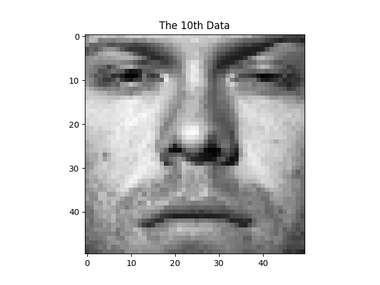
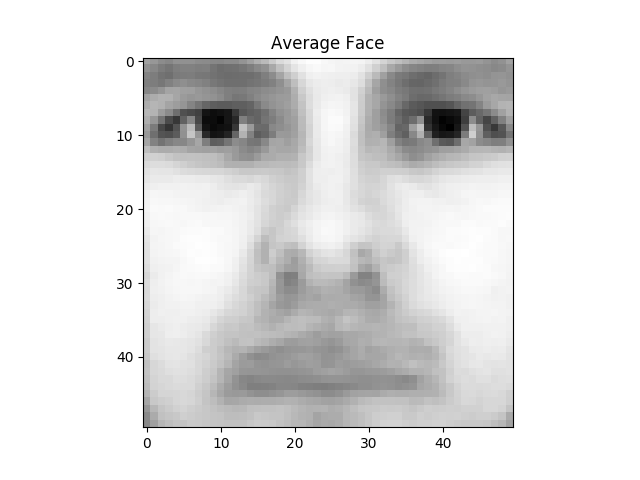
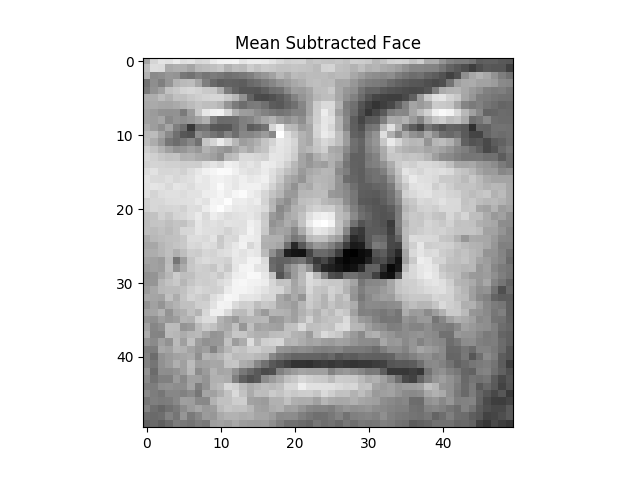
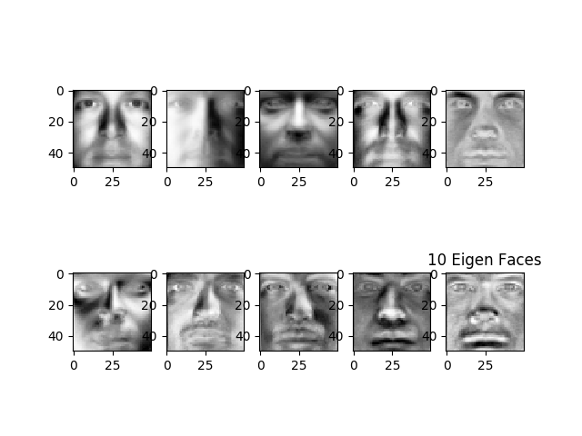
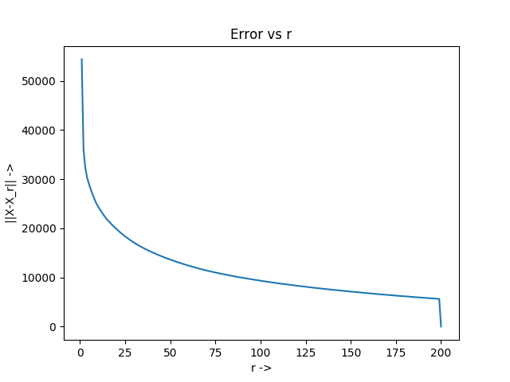
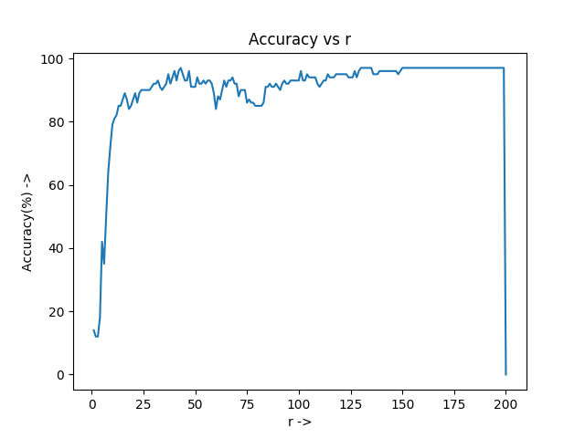

# Face Recognition using Principal Component Analysis(PCA) in Python

In this assignment we will implement the Eigenface method for recognizing human faces. You will
use face images from The Yale Face Database B, where there are 64 images under different lighting
conditions per each of 10 distinct subjects, 640 face images in total.  With our implementation,
we will explore the power of the Singular Value Decomposition (SVD) in representing face images.

## Dataset

The data set can be found <a href = "http://cornelltech.github.io/cs5785-fall-2017/data/faces.zip">here</a>.
The data set is a file as *face.zip*, which contains all the training and test images;
**train.txt** and **test.txt** specifies the training set and test (validation) set split respectively, each line gives an image path and the correspond-
ing label.

## Loading data
Load the training set into a matrix X:  there are 540 training images in total, each has 50
×
50
pixels that need to be concatenated into a 2500-dimensional vector.  So the size of
X
should
be 540
×
2500, where each row is a flattened face image.

Here is an instance of loaded data, we get when we load from X:


## Finding Average Face

A sum of all the rows, divided by the total number of rows gives us 
an *Average Face* which, serves as origin for component analysis.

Here is the **Average Face** evaluated in our code:


## Finding Eigen-Faces

We subtract  average  face
μ
from  every  column  in
X
.   That  is,
x
i
:
=
x
i
−
μ
,
where
x
i
is the
i
-th column of
X
.  
 The mean subtracted face of tenth person is:
 
 
 Perform Singular Value Decomposition (SVD) on training set
X
(
X
=
U
Σ
V
T
) to get
matrix
V
T
, where each row of
V
T
has the same dimension as the face image.  We refer to
v
i
,
the
i
-th row of
V
T
, as
i
-th
eigenface
. Here are the first 10 eigenfaces as 10 images in grayscale.



##  Low-rank Approximation 
 Since
Σ
is a diagonal matrix with non-negative real numbers on
the diagonal in non-ascending order, we can use the first
r
elements in
Σ
together with first
r
columns in
U
and first
r
rows in
V
T
to approximate
X
.  That is, we can approximate
X
by
ˆ
X
r
=
U
[:, :
r
]
Σ
[:
r
, :
r
]
V
T
[:
r
, :].  The matrix
ˆ
X
r
is called rank-
r
approximation of
X
.  Here is a plot of the
rank-
r
approximation error
‖
X
−
ˆ
X
r
‖
F
2
as a function of
r
when
r
=
1, 2, . . . , 200.



## Eigenface  Feature
   
   The  top
r
eigenfaces
V
T
[:
r
, :]
=
{
v
1
,
v
2
, . . . ,
v
r
}
T
span  an
r
-dimensional
linear subspace of the original image space called
face space
, whose origin is the average face
μ
,  and whose axes are the eigenfaces {
v
1
,
v
2
, . . . ,
v
r
}.   Therefore,  using the top
r
eigenfaces
{
v
1
,
v
2
, . . . ,
v
r
}, we can represent a 2500-dimensional face image
z
as an
r
-dimensional feature
vector
f
:
f
=
V
T
[:
r
, :]
z
=
[
v
1
,
v
2
, . . . ,
v
r
]
T
z

In order to get
F
, multiply
X
to the transpose of first
r
rows of
V
T
,
F
should have same number of rows as
X
and
r
columns;
similarly for
X
test

## Face Recognition
 We extract training and test features for
r
=10.  We train a Logistic Regression
model using
F
and test on
F
test
.  Now we see the plot of Accuracy vs r:



We note that the maximum accurcy **saturates** at **96%**.
Also there is **NO** dip at 200, it is a faulty representation

## Output
Also, the text output of code is:

```
r = 10
Testing Accuracy : 79.0 %

```

Thus at r=10, the accuracy on test data is **79%**.